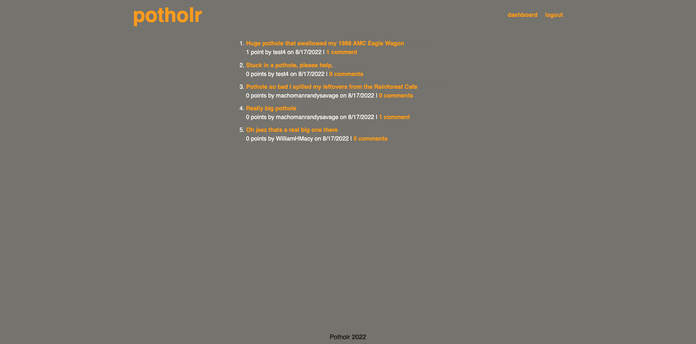
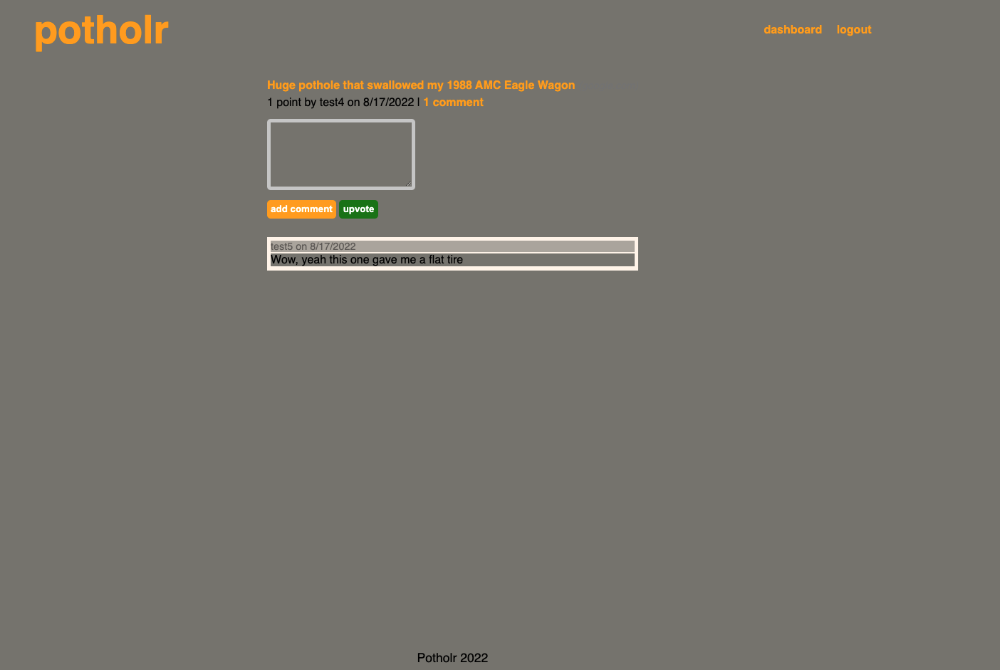

# Project Description

In 2nd group project, our team (Bandwith of Brothers) set out to create a web app designed to have users add complaints about pot holes.

# Installation

To view the project, clone the git repository using VS Code. this will allow you to vie the index.html file ass well as the css style file. The website can be view by right clicking in the index.html file and opening via web browser.
Link to deployed website:

# Usage

# User Story

AS A driver
I WANT to see where potholes are in the city
SO THAT I can plan my driving accordingly and avoid potholes

# Changelog

## v1.0.0

- created file structures
- updated databases
- updated handelbars
- created javascript files
- updated css
- updated css and handlebars to provide a better user experience
- created a repo on github
- fixed image pathing
- updated bugs

# License

Copyright (c) 2022 Bandwith of Brothers
Permission is hereby granted, free of charge, to any person obtaining a copy
of this software and associated documentation files (the "Software"), to deal
in the Software without restriction, including without limitation the rights
to use, copy, modify, merge, publish, distribute, sublicense, and/or sell
copies of the Software, and to permit persons to whom the Software is
furnished to do so, subject to the following conditions:
The above copyright notice and this permission notice shall be included in all
copies or substantial portions of the Software.
THE SOFTWARE IS PROVIDED "AS IS", WITHOUT WARRANTY OF ANY KIND, EXPRESS OR
IMPLIED, INCLUDING BUT NOT LIMITED TO THE WARRANTIES OF MERCHANTABILITY,
FITNESS FOR A PARTICULAR PURPOSE AND NONINFRINGEMENT. IN NO EVENT SHALL THE
AUTHORS OR COPYRIGHT HOLDERS BE LIABLE FOR ANY CLAIM, DAMAGES OR OTHER
LIABILITY, WHETHER IN AN ACTION OF CONTRACT, TORT OR OTHERWISE, ARISING FROM,
OUT OF OR IN CONNECTION WITH THE SOFTWARE OR THE USE OR OTHER DEALINGS IN THE
SOFTWARE.
